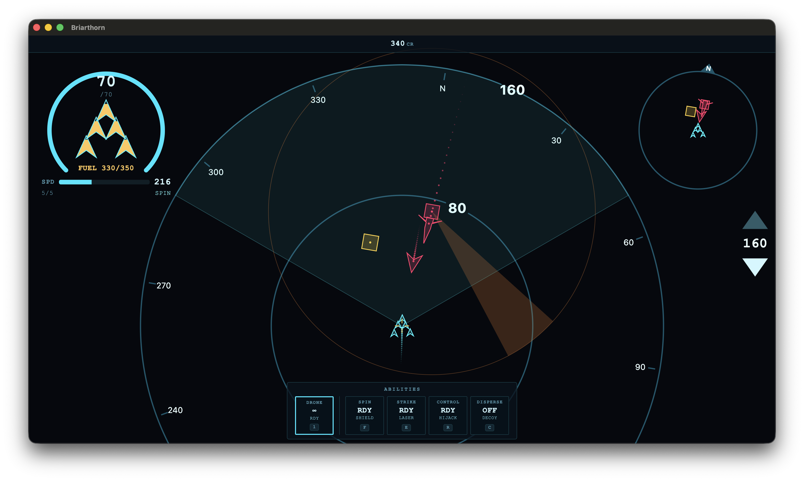

# briarthorn



[](https://github.com/funnansoftware/briarthorn/actions/workflows/windows.yml)
[](https://github.com/funnansoftware/briarthorn/actions/workflows/macos.yml)
[](https://github.com/funnansoftware/briarthorn/actions/workflows/linux.yml)
[](https://github.com/funnansoftware/briarthorn/actions/workflows/coverage.yml)
[](https://github.com/funnansoftware/briarthorn/actions/workflows/web.yml)
[](https://github.com/funnansoftware/briarthorn/actions/workflows/android.yml)
[](https://github.com/funnansoftware/briarthorn/actions/workflows/zig.yml)
[](https://github.com/funnansoftware/briarthorn/actions/workflows/steamos.yml)

A cross-platform C++23 roguelike that requires the player to pilot a unique aircraft class to fight through enemies and challenges to discover the mystery of briarthorn.

# Get Started

Pick your platform below. Each builds two ways — with **Zig** or with **CMake & Ninja**:

- [Prerequisites](#prerequisites)
- [Platforms](#platforms)
  - [windows](#windows)
  - [linux](#linux)
  - [mac](#macos)
  - [web](#web)
  - [steamos](#steamos)
  - [android](#android)
- [License](#license)

# Prerequisites

briarthorn vendors vcpkg and emsdk as submodules, so clone recursively:

```sh
git clone --recurse-submodules https://github.com/funnansoftware/briarthorn.git
```

Every build also needs [git](https://git-scm.com/) and a few system libraries:

| OS      | Install                                                                                |
| ------- | -------------------------------------------------------------------------------------- |
| Linux   | `sudo apt install libxinerama-dev libxcursor-dev xorg-dev libglu1-mesa-dev pkg-config` |
| macOS   | Xcode Command Line Tools: `xcode-select --install`                                     |
| Windows | nothing extra — the Windows SDK from Visual Studio covers it                           |

Then set up one toolchain — Zig, or CMake & Ninja.

## With Zig

- [zig](https://ziglang.org/download/) — a nightly build, pinned in
  [.zigversion](.zigversion) (currently `0.17.0-dev.1275+59a628c6d`).
- On macOS, also `brew install pkg-config`.

## With CMake & Ninja

- [CMake](https://cmake.org/download/) &ge; 3.31,
  [Ninja](https://github.com/ninja-build/ninja/releases), and a C++23 compiler:
  Visual Studio 2022 (Windows), GCC (Linux), or Homebrew LLVM (`brew install
llvm@21`, macOS).
- **web** also needs the emscripten SDK — run `scripts/bootstrap-emsdk.sh`
  (Linux/macOS) or `scripts\bootstrap-emsdk.bat` (Windows) once.
- **android** also needs an [NDK](https://developer.android.com/ndk), plus an SDK
  and JDK to package an APK.

# Platforms

## Windows

Needs [Zig](#with-zig) or [CMake & Ninja](#with-cmake--ninja).

### With Zig

```sh
zig build run
```

### With CMake & Ninja

Run from a Visual Studio 2022 developer shell:

```sh
cmake --preset windows                            # configure (release)
cmake --build --preset windows                    # build
cmake --build --preset windows --target install   # install
build/windows/installed/bin/briarthorn.exe    # run
```

## Linux

Needs [Zig](#with-zig) or [CMake & Ninja](#with-cmake--ninja).

### With Zig

```sh
zig build run
```

### With CMake & Ninja

```sh
cmake --preset linux                            # configure (release)
cmake --build --preset linux                    # build
cmake --build --preset linux --target install   # install
./build/linux/installed/bin/briarthorn      # run
```

## MacOS

Needs [Zig](#with-zig) or [CMake & Ninja](#with-cmake--ninja).

### With Zig

```sh
zig build run
```

### With CMake & Ninja

```sh
cmake --preset macos                            # configure (release)
cmake --build --preset macos                    # build
cmake --build --preset macos --target install   # install
./build/macos/installed/bin/briarthorn      # run
```

## Web

Needs [Zig](#with-zig) or [CMake & Ninja](#with-cmake--ninja). Either way, serve
the output over http and open the `.html`.

### With Zig

Cross-compiles from any host:

```sh
zig build -Dtarget=wasm32-emscripten
python3 -m http.server -d build/wasm32-emscripten-releasefast/installed/web
# open http://localhost:8000/briarthorn.html
```

### With CMake & Ninja

Build the `web-release` preset (there's no bare `web` shorthand):

```sh
cmake --preset web-release
cmake --build --preset web-release
cmake --build --preset web-release --target install
python3 -m http.server -d build/web-release/installed/web
# open http://localhost:8000/briarthorn.html
```

## SteamOS

Needs [Zig](#with-zig) or [CMake & Ninja](#with-cmake--ninja), built inside the
`briarthorn-steamos` devcontainer (**Dev Containers: Reopen in Container →
briarthorn-steamos**).

SteamOS is x86_64 Linux, so a normal build produces a Steam Deck binary — but one
built in the main devcontainer fails on the Deck with `GLIBC_x.xx not found`,
because its glibc is newer than the Deck's. The
[`steamos` devcontainer](.devcontainer/steamos) builds against the older Steam
Linux Runtime "sniper" glibc (2.31), which the Deck can run.

### With Zig

```sh
zig build        # release -> build/x86_64-linux-gnu-releasefast/installed
```

Copy `build/x86_64-linux-gnu-releasefast/installed/` to the Deck and run
`bin/briarthorn` from Desktop Mode, or add it to Steam as a non-Steam game.

### With CMake & Ninja

The `linux-zig-release` preset drives the same toolchain:

```sh
cmake --preset linux-zig-release
cmake --build --preset linux-zig-release
cmake --build --preset linux-zig-release --target install
```

## Android

Needs [Zig](#with-zig) or [CMake & Ninja](#with-cmake--ninja).

### With Zig

Cross-compiles from any host:

```sh
zig build -Dtarget=aarch64-linux-android
adb install build/aarch64-linux-android-releasefast/installed/apk/app-release.apk
```

Pass `-Dandroid-api=<level>` for a specific API level (default 35).

### With CMake & Ninja

These presets need a Linux host (build from another host with [Zig](#with-zig-6)
above). Build `android-release`, then package an APK with the `apk` target:

```sh
cmake --preset android-release                        # configure
cmake --build --preset android-release                # build
cmake --build --preset android-release --target apk   # package the APK
adb install build/android-release/outputs/apk/release/app-release.apk
```

Gradle finds your SDK via `android/local.properties` — create it with
`sdk.dir=/path/to/android-sdk`.

# License

Non-commercial use — see [LICENSE.md](LICENSE.md).
